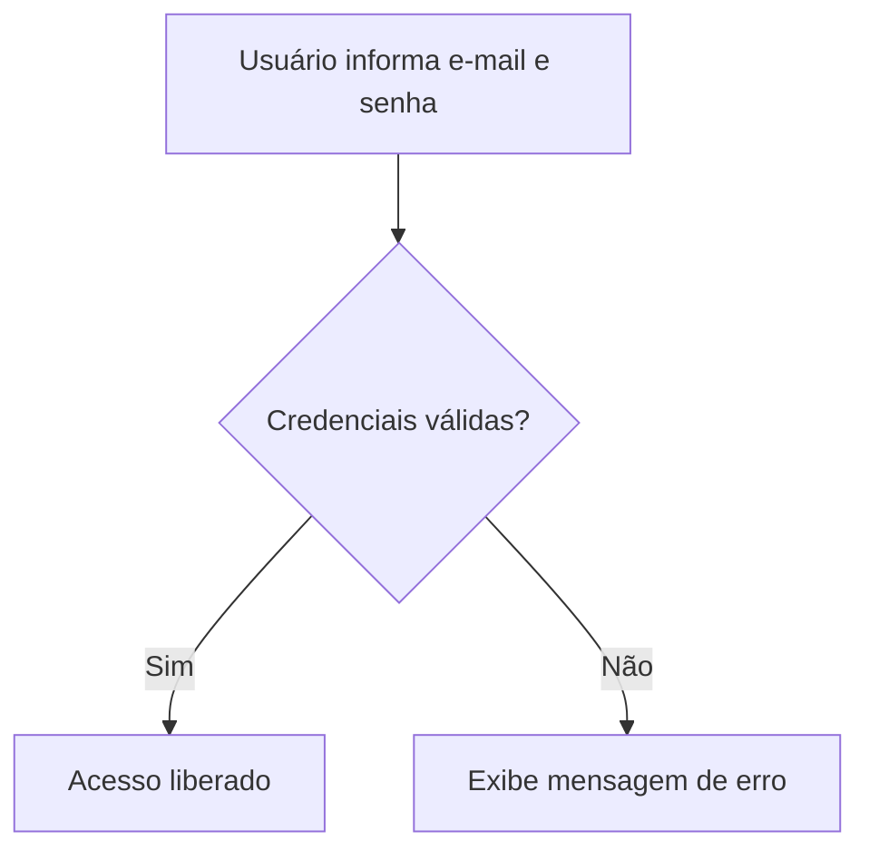

# Guia do Usuário

## Instalação

1. Instale o Python.
2. Instale o MkDocs: `pip install mkdocs mkdocs-material`.
3. Rode o servidor local com `mkdocs serve` e acesse `http://127.0.0.1:8000`.

## Fluxo de login

O diagrama abaixo representa o processo de login (entrada de dados, verificação e resultado):

